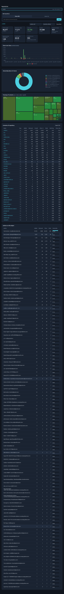

# Repo Analysis Tool (RAT)

A self-contained web dashboard for analysing git repositories: import by URL
clone or by zipped `.git` archive, browse the object tree, and inspect every
metric from the COMS3011A brief — file, directory, repository, commit-set and
author metrics — filtered by repository, author, object (file/directory) and
commit set (date range or hand-picked commits).



## Quick start

```bash
./start.sh                         # installs deps + serves http://127.0.0.1:5000
```

Or manually:

```bash
pip install -r requirements.txt    # Flask is the only runtime dependency
python3 -m server.app              # serves http://127.0.0.1:5000
```

Then either paste a clone URL (e.g. `https://github.com/DaveGamble/cJSON.git`)
into the sidebar or drop in a zip archive that contains the `.git` directory.
Import progress (clone → parse) is shown live. All data is parsed **once**
into `data/rat.db` (gitignored); every later query is answered from the
indexed database in milliseconds — the repository is never re-parsed.

## Features

- **Ingestion** — zip upload (with `.git`) or deep clone from a URL; multiple
  repositories side by side; live job progress; clear errors for bad zips and
  failed clones.
- **Object navigation** — breadcrumb tree through the repository; click any
  directory or file row (or treemap rectangle) to analyse it.
- **Filters** — author multi-select (canonical identities), commit set:
  all-time, date range (`from` inclusive, `to` exclusive) or a manually
  selected commit list with search; all filters compose.
- **Metrics** — eight dashboard cards per object: added, removed, growth,
  churn, modifications `n(H,o)`, modification frequency `n/|H|`, churn rate
  `λ/|H|` and `|H|`; sortable children table; per-author table with ownership
  bars.
- **Charts** — churn over time (stacked added/removed bars, adaptive
  day/week/month buckets), ownership doughnut, and a squarified treemap
  (area = churn, colour = growth) for the current directory.
- **Author merge** — `.mailmap` identities are merged automatically at import;
  the Authors tab lists every raw identity with its totals and merges any
  selection into one display identity with a single click (persisted).
- **Export** — the children table exports to CSV.

## Metrics implemented

Notation follows the brief; `H` is the selected commit set, `o` an object,
`a` an author.

| Brief | Dashboard card / column | Definition |
| --- | --- | --- |
| `l+(H,o)` | Added | lines added in `H` under `o` |
| `l-(H,o)` | Removed | lines removed (deletions report the removed lines on the deleted path) |
| `δ(H,o)` | Growth | `l+ − l−` |
| `λ(H,o)` | Churn | `l+ + l−` |
| `n(H,o)` | Modifications | commits in `H` in which `o` had positive churn |
| `η(H,o)` | Modification frequency | `n(H,o) / |H|` (0 when `|H| = 0`) |
| `ρ(H,o)` | Churn rate | `λ(H,o) / |H|` |
| `n(H,o,a)` | Author table | modifications attributed to one author group |
| `ω(H,o,a)` | Ownership | `λ(H,o,a) / λ(H,o)` |

Commit sets: `H̄` = non-merge commits reachable from the reference commit
(HEAD by default), `H_t` = commits with `ts ≥ t`, `H_{i,j}` = commits with
`i ≤ ts < j`, plus a manual commit list; the author filter further narrows
`H` to the selected canonical identities.

Implementation rules that keep the numbers exact:

- Measurement is `git log --no-merges -M50% --numstat -z --use-mailmap`
  parsed in one streaming pass; **binary files are excluded** (`numstat`
  reports `-`), merge commits are excluded, **renames are attributed to the
  new path** (a pure rename is a 0/0 record and changes nothing).
- Author identities are the mailmap-canonical `Name <email>` pairs
  (`%aN <%aE>`); a manual merge rewrites one `group_key` column — no history
  rewrite, no re-import.
- Directory (and repository) metrics **telescope**: the sum of descendant
  files equals the directory total, so every object metric is a single
  indexed SQL aggregation over `path LIKE d || '/%'` (repository = all rows).
  A file and a directory that share a name at different points in history
  are distinct objects (see the `git-gui` note under *Verification*).

## Architecture

```
browser ─── static/index.html + app.js + charts.js + Chart.js (vendored)
   │                    │ fetch JSON
   ▼                    ▼
Flask app (server/app.py) ── REST endpoints, background import jobs
   │            │
   │            ▼
   │      server/metrics.py ── metric SQL builders (file/dir/repo/commit-set/author)
   │            │
   ▼            ▼
server/ingest.py ── zip extract / git clone, streaming `git log` parser
   │
   ▼
server/db.py ── SQLite (WAL), one row per measured file per commit
```

- **Parse-once design.** `changes(repo_id, sha, ts, author_id, path, added,
  removed)` holds one row per measured file per non-merge commit, so every
  query — any filter combination — is plain indexed SQL; `ts` and
  `author_id` are denormalised to avoid joins.
- **Streaming parser.** `git log … -z` output is parsed incrementally in
  ~40 KB chunks and flushed to SQLite every 2000 commits (WAL,
  `synchronous=NORMAL`), so the memory footprint is flat even for git.git.
- **Background jobs.** Clone/zip import runs in a thread with a pollable job
  object; failures (bad zip, unreachable URL, unknown ref) surface the real
  error in the UI.
- **Frontend.** Vanilla ES5-level JS (no build step), Chart.js vendored
  locally (no CDN), hand-rolled squarified treemap (SVG) — the app works
  fully offline once loaded.

## Verification

### 1. Automated tests

```bash
python3 -m pytest tests -q       # 33 tests: metric engine, fixture ledger, API e2e
```

`tests/fixture.py` builds a deterministic 12-commit repository that exercises
add / modify / delete / pure rename / rename-with-change / binary exclusion /
nested directories / mailmap aliases / an empty commit, with hand-computed
expected values documented in its docstring. `tests/test_metrics.py` asserts
every formula above, `tests/test_api.py` covers the HTTP flow end to end
(zip import, job polling, filters, tree, commit search, author merge,
multi-repo isolation, deletion).

### 2. Reference cross-check (the CSVs shipped with the brief)

`tests/compare_reference.py` clones each repository, imports it pinned at the
CSV's `ref_sha`, then replays **every object row** through the public
`/api/repos/<id>/metrics` endpoint and compares added / removed / growth /
churn / modifications / modification_frequency / churn_rate and the
per-author rows (added / removed / churn / modifications / ownership):

```bash
python3 tests/compare_reference.py tests/references/cJSON_6d9f2443ab07.csv.gz \
    --url https://github.com/DaveGamble/cJSON.git
```

| Repository | Ref | `|H|` | Objects checked | Result |
| --- | --- | --- | --- | --- |
| cJSON | `6d9f2443ab07` | 955 | 291 | **all values match** |
| Redis | `b540ca49cba8` | 11 874 | 3 068 | **all values match** |
| git.git | `5a7d1e8045ce` | 61 101 | 7 615 | **all values match** |

Every metric, every rate and every ownership share in all three reference
files reproduces exactly — 81 884 data rows covering 10 974 objects and
2 500+ author identities.

A second, independent cross-check covers the selections the CSVs do not:
`tests/ground_truth.py` re-parses a repository with a *different* parser
(plain-text `numstat` with arrow/brace rename notation, the opposite strategy
to the NUL-separated stream parser in `server/ingest.py`) and compares it to
the API for time windows (`from`/`to`) and manual commit lists; e.g. on cJSON
pinned at `6d9f2443ab07`, a 1600000000–1620000000 window and a 37-commit
selection both match exactly.

*The `git-gui` note:* git.git contains both a historical **file** named
`git-gui` (5735/1963 lines) and a modern **directory** `git-gui/`. The
reference treats them as distinct objects; RAT does the same (file metrics
match by exact path, directory metrics sum descendants `git-gui/%`), which is
the one edge case that needed a dedicated fix during cross-checking.

### 3. Performance

Measured on the machine used for development (single core, WAL SQLite);
import time is one streaming parse pass, clone time additionally depends on
the network:

| Repository | Non-merge commits | Parse + import (measured) |
| --- | --- | --- |
| cJSON | 955 | 0.3 s |
| Redis | 11 874 | 9.4 s |
| git.git | 61 101 | 31.6 s (~1 900 commits/s) |

Dashboard queries after import are a handful of indexed aggregates
(measured: 62 ms per object on git.git in a sweep over all 7 615 objects,
including every per-author row) and never re-run git.

## REST API

| Method & path | Purpose |
| --- | --- |
| `POST /api/repos` | add repo — multipart `file` (zip) or JSON `{"url"}`; returns a job |
| `GET /api/jobs/<id>` | import progress (`cloning`/`extracting`/`parsing`/`done`/`error`) |
| `GET/DELETE /api/repos` | list / remove repositories |
| `GET /api/repos/<id>/metrics` | `?path=&kind=dir|file&authors=[..]&from=&to=&shas=` → cards, authors, children, timeseries (`&light=1` skips children/timeseries) |
| `GET /api/repos/<id>/commits` | `?q=&limit=&offset=` — commit picker |
| `GET /api/repos/<id>/tree` | `?path=` — object browser |
| `GET /api/repos/<id>/authors` · `POST .../authors/merge` | identities; merge a selection into one display name |

## Project layout

```
start.sh                   install deps + launch (http://127.0.0.1:5000)
server/app.py              Flask app, REST API, background job registry
server/db.py               SQLite schema + connection helpers
server/ingest.py           zip/clone import, streaming git-log parser
server/metrics.py          metric SQL builders + adaptive time series
static/                    dashboard (index.html, app.js, charts.js, styles.css)
static/vendor/chart.umd.js vendored Chart.js
tests/fixture.py           deterministic fixture repository (hand-computed ledger)
tests/test_metrics.py      28 metric-engine tests
tests/test_api.py          5 end-to-end API tests
tests/compare_reference.py reference-CSV cross-check (see above)
tests/references/*.csv.gz  the three reference CSVs from the brief
data/                      runtime database + materialised repos (gitignored)
```

## AI-use declaration

In line with the test instructions: the backend (parser, metrics engine, API),
the frontend and the test/verification tooling in this repository were
developed with the assistance of an AI coding assistant (Qoder agentic IDE,
agent mode) under my direction. All metric definitions were taken from the
brief, and **every number produced by RAT was independently verified against
the reference CSVs shipped with the brief** using
`tests/compare_reference.py`, plus the automated fixture tests — the AI did
not supply and was not trusted for any expected values. I reviewed and
understand the complete implementation.

*(Complete/edit this declaration to match your submission's requirements.)*
